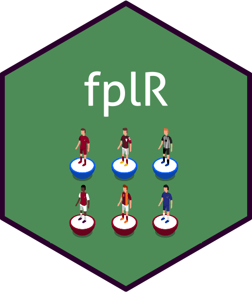

```{r, include = FALSE}
knitr::opts_chunk$set(collapse = TRUE, eval = FALSE)
```

# fplr 

[](https://travis-ci.org/ewenme/fplR) 
[](https://www.tidyverse.org/lifecycle/#maturing)

An R package that provides a compendium of tools for working with [Fantasy Premier League](https://fantasy.premierleague.com) (FPL) data in R.

## Installation

Get the development version from GitHub. Because of the lack of dev support from FPL, the package is unlikely to be submitted to CRAN anytime soon.

```{r}
if (!require(remotes)) {
  install.packages("remotes") 
  }

# install package from github
remotes::install_github("ewenme/fplr")
```

## Usage

### Example analysis

[FPL Mythbusting with fplr](https://ewen.io/2017/06/25/fpl-mythbusting-with-fplr/)

### Player data

Get summary data on all players in the current FPL season:

```{r}
# load package
library(fplr)

fpl_get_players()
?fpl_get_players
```

Get detailed (gameweek-level) data on a player in the current FPL season:

```{r, eval = FALSE}
fpl_get_player_detailed(player_id = 12)
?fpl_get_player_detailed
```

### User data

#### Get data on a user's gameweek performance in the current FPL season:

```{r, eval = FALSE}

fpl_get_user_gameweek(user_id = 123, gameweek = 10)
?fpl_get_user_gameweek

```

## Collaborators

If you want to contribute to the package:

* I followed the principles in Hadley Wickham's [R packages book](http://r-pkgs.had.co.nz/)
* Follow the GitHub fork/pull request [model](https://guides.github.com/introduction/flow/), or contact me directly

Please note that this project is released with a [Contributor Code of Conduct](CODE_OF_CONDUCT.md). By participating in this project you agree to abide by its terms.
